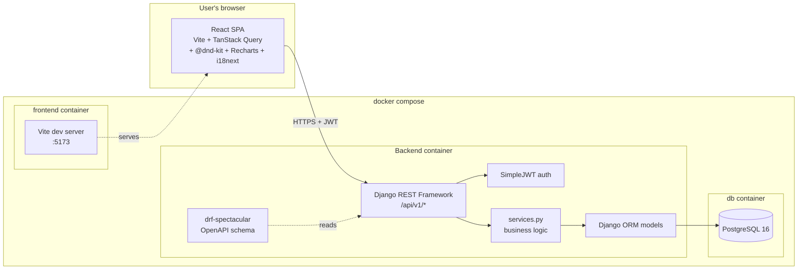
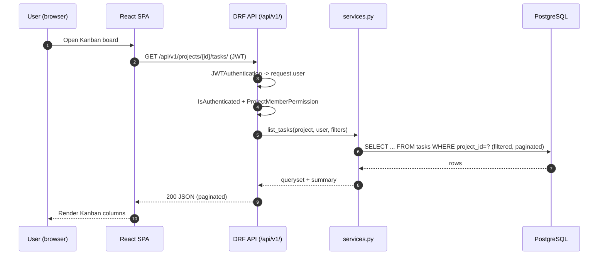

# Architecture

## C4-style component diagram (Mermaid)

## Request lifecycle (typical: "list tasks on a project")

## Layers & rules

| Layer            | Responsibility                                                | Where                                  |
|------------------|---------------------------------------------------------------|----------------------------------------|
| Presentation     | HTTP, serialization, pagination, permissions                  | DRF viewsets, `apps/*/views.py`        |
| Service          | Business logic (status transitions, progress, reports)       | `apps/*/services.py`                   |
| Domain/Model     | Data + invariants + computed properties                        | `apps/*/models.py`                     |
| Persistence      | ORM, migrations, indexes                                      | Django ORM + `apps/*/migrations/`      |
| Infra            | DB, cache, email backend (stubbed)                            | `config/settings.py`                   |

Rules (from the django-api skill):
- Model → Serializer → Service → ViewSet → URL → Test. Always in this order.
- Business logic lives in `services.py`, never in views or serializers.
- N+1 queries avoided with `select_related`/`prefetch_related`.
- Every endpoint has OpenAPI docs (drf-spectacular) and a pytest test.

## Why these choices (thesis justification)

- **API-first** — frontend is a pure SPA; the same API serves the demo and any future mobile client.
- **Fat models / thin views / services for logic** — keeps each layer testable and explainable.
- **LocMem cache + stubbed email** — thesis demo needs no external services beyond Postgres.
- **Docker** — defense demo is `docker compose up` and ready.
