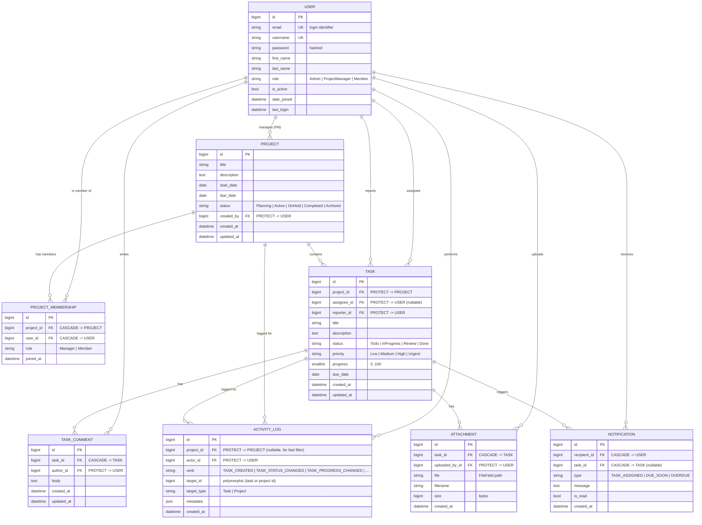

# Entity-Relationship Diagram (ERD)

> **Status: CONFIRMED — models implemented in Phase 2.**
> The Django models live in `backend/apps/*/models.py` and match this ERD.

## Design notes

1. **User accounts** extend Django's `AbstractUser` with a single global `role` field
   (`Admin`, `ProjectManager`, `Member`). Auth is JWT (simplejwt).
2. **Per-project role** lives on `ProjectMembership` (`Manager` / `Member`), so one user can be a
   Manager in Project A and a Member in Project B. The global role caps the maximum privilege.
3. **Project progress is computed**, never stored. `project.progress` is a `@property` that returns
   `avg(task.progress)`. No denormalized column — keeps the source of truth in `Task`.
4. **FK delete rules:**
   - `Task.assignee` / `Task.reporter` → `on_delete=PROTECT` (preserve history; never lose tasks
     by deleting a user — Admin must reassign first).
   - `Task.project` → `on_delete=PROTECT` (a project with tasks cannot be hard-deleted; archive instead).
   - `TaskComment` / `Attachment` → `on_delete=PROTECT` w.r.t. user, `CASCADE` w.r.t. task.
   - `ActivityLog` → `on_delete=PROTECT` for `actor` (audit trail must survive user deletion).
   - `Notification` → `on_delete=CASCADE` (a deleted user's in-app notifications are no longer relevant).
5. **Indexes** (per db-design skill rules):
   `Task(status)`, `Task(assignee)`, `Task(due_date)`, `ActivityLog(project, created_at)`.
6. **ActivityLog is append-only** — actor + verb + target_type/target_id + timestamp + JSON metadata.
   Powers both the activity feed and the progress-over-time report (verb=`TASK_PROGRESS_CHANGED`).
7. **ActivityLog target**: modeled as `(target_type` string + `target_id` BigInteger) instead of
   django.contenttypes — simpler to explain and defend in the thesis, and the reports only need
   project-scoped filtering (served by the indexed `project` FK). A direct `project` FK is kept for
   fast per-project filtering (indexed on `project, created_at`).
8. **Attachment** stores `file` (FileField) + `filename` + `size` + `uploaded_by`. Stored under
   `/media/attachments/<task_id>/<filename>`.
9. **Status / priority / role choices** are string enums (not integer codes) for readability in the
   DB and in API responses — easier to defend in the thesis report.
10. **Timestamps** (`created_at`, `updated_at`) on every model, per the django-api skill checklist.

## Mermaid ERD



## Constraints summary

| Table                | Constraint                                                                                            |
|----------------------|-------------------------------------------------------------------------------------------------------|
| ProjectMembership    | UNIQUE(project_id, user_id) — a user appears once per project.                                       |
| Task                 | CHECK (progress BETWEEN 0 AND 100).                                                                  |
| Task                 | CHECK (due_date IS NULL OR due_date >= project.start_date) — enforced in service layer.             |
| ProjectMembership    | CHECK role IN ('Manager','Member').                                                                  |
| ActivityLog          | Read-only after insert (enforced in model — no update path exposed).                                 |
| Notification         | Index on (recipient, is_read, created_at) for the unread feed.                                       |

## Permissions matrix (recap — drives row-level filtering in viewsets)

| Action                     | Admin | PM (own project) | Member (own project) |
|----------------------------|:-----:|:----------------:|:--------------------:|
| List all projects          |  ✓    | own only         | own only             |
| Create project             |  ✓    | ✓                | ✗                    |
| Update/delete project      |  ✓    | own              | ✗                    |
| Add/remove members         |  ✓    | own              | ✗                    |
| Create task                |  ✓    | own              | ✗                    |
| Update task status/progress|  ✓    | own              | assigned only        |
| Comment                    |  ✓    | own              | own projects         |
| View reports               |  ✓    | own              | own (read-only)      |
```
