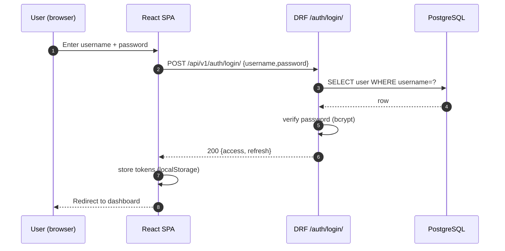
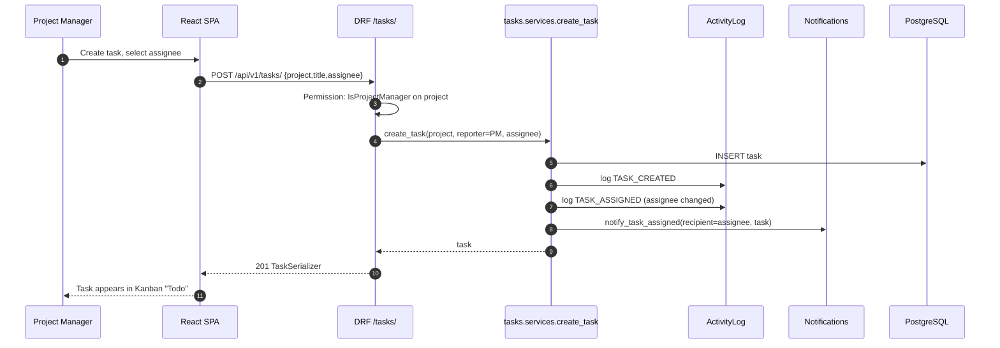
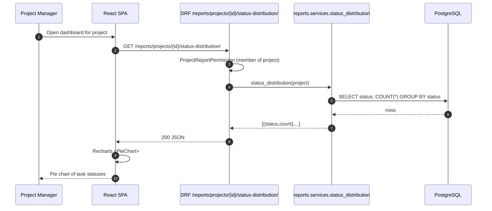

# Sequence Diagrams

## 1. Login (JWT issuance)

```mermaid
sequenceDiagram
    autonumber
    participant U as User (browser)
    participant R as React SPA
    participant A as DRF /auth/login/
    participant DB as PostgreSQL

    U->>R: Enter username + password
    R->>A: POST /api/v1/auth/login/ {username,password}
    A->>DB: SELECT user WHERE username=?
    DB-->>A: row
    A->>A: verify password (bcrypt)
    A-->>R: 200 {access, refresh}
    R->>R: store tokens (localStorage)
    R-->>U: Redirect to dashboard
```

## 2. Task assignment

```mermaid
sequenceDiagram
    autonumber
    participant PM as Project Manager
    participant R as React SPA
    participant A as DRF /tasks/
    participant S as tasks.services.create_task
    participant L as ActivityLog
    participant N as Notifications
    participant DB as PostgreSQL

    PM->>R: Create task, select assignee
    R->>A: POST /api/v1/tasks/ {project,title,assignee}
    A->>A: Permission: IsProjectManager on project
    A->>S: create_task(project, reporter=PM, assignee)
    S->>DB: INSERT task
    S->>L: log TASK_CREATED
    S->>L: log TASK_ASSIGNED (assignee changed)
    S->>N: notify_task_assigned(recipient=assignee, task)
    S-->>A: task
    A-->>R: 201 TaskSerializer
    R-->>PM: Task appears in Kanban "Todo"
```

## 3. Report generation (status distribution)

```mermaid
sequenceDiagram
    autonumber
    participant PM as Project Manager
    participant R as React SPA
    participant A as DRF /reports/projects/{id}/status-distribution/
    participant S as reports.services.status_distribution
    participant DB as PostgreSQL

    PM->>R: Open dashboard for project
    R->>A: GET /reports/projects/{id}/status-distribution/
    A->>A: ProjectReportPermission (member of project)
    A->>S: status_distribution(project)
    S->>DB: SELECT status, COUNT(*) GROUP BY status
    DB-->>S: rows
    S-->>A: [{status,count},...]
    A-->>R: 200 JSON
    R->>R: Recharts <PieChart>
    R-->>PM: Pie chart of task statuses
```
